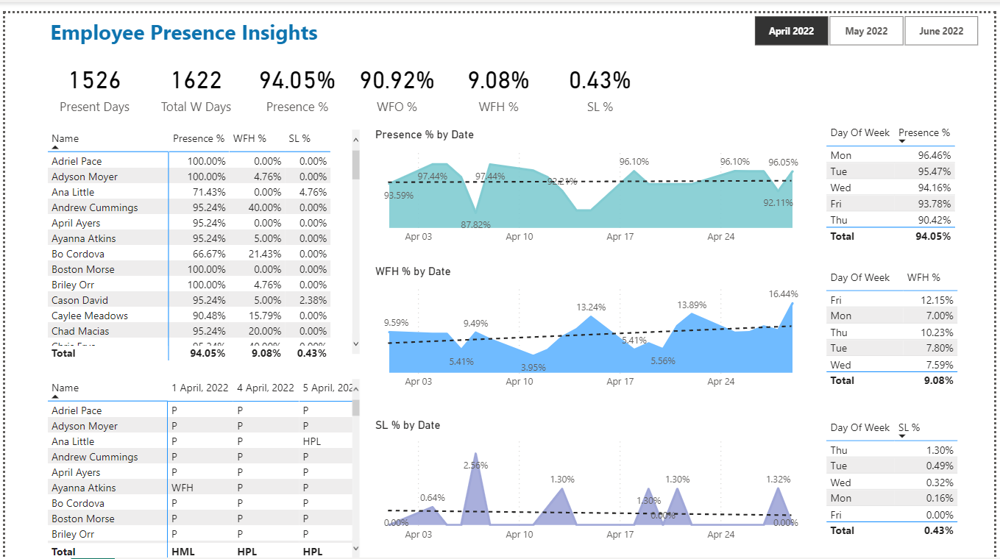

# HR Insights – Employee Presence Dashboard

Power BI dashboard solving a real-time HR challenge for Atliq Technologies, analysing employee attendance, work-from-home trends, and sick leave patterns.

## 🎯 Business Questions
| Insight | Benefit |
|--------|---------|
| Which days do employees prefer WFH? | Helps plan team activities, office space, and hybrid work schedules |
| Is sick leave clustered around specific periods? | Flags potential health concerns needing a sensitisation plan |
| Which employees take sick leave at the same time each year? | Enables proactive wellness support e.g. allergy management, flu shots |

## 📊 Dashboard Preview

## 🛠️ Tools Used
- Microsoft Excel
- Power BI (DAX, measures, slicers)

## 📂 Data Source
Project guided by [Codebasics](https://github.com/codebasics) — [YouTube Tutorial](https://youtu.be/ru1qeDO_qrc)
